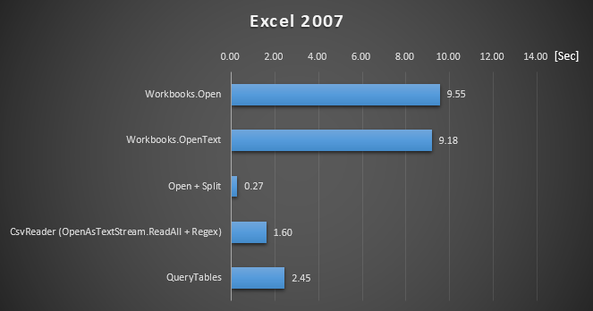
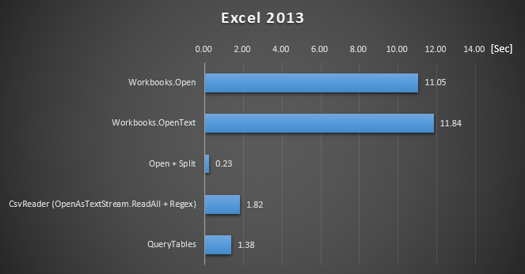

# CsvReader for Excel VBA
CSVファイルを読むためのクラスモジュールです。  
そこそこのパフォーマンスです。  
１つのファイルをインポートすればいいので簡単に導入出来ます。  
また、Workbooks.OpenでCSVファイルを開いていたコードから簡単に変更できます。

```vbnet
    ' Workbooks.Openを使ってCSVファイルを開くコード
    Dim wb As Workbook
    Dim ws As Worksheet
    Set wb = Workbooks.Open(filePath)
    Debug.Print wb.Worksheets(1).Cells(1, 3)
    wb.Close
```

```vbnet
    ' CsvReaderを使ってCSVファイルを開くコード
    Dim reader As CsvReader
    Set reader = New CsvReader
    Call reader.OpenCsv(filePath)
    Debug.Print reader.At(1, 3)
```

# パフォーマンス
Workbooks.Openと比較すると高速です。





# 導入方法
1. CsvReader.clsをダウンロードしてください。
2. VBEで導入したいプロジェクトを右クリックして、[ファイルのインポート]でCsvReader.clsを選択してください。

# 参考
https://qiita.com/minoru-nagasawa/items/7c68f88a5a287b606451
